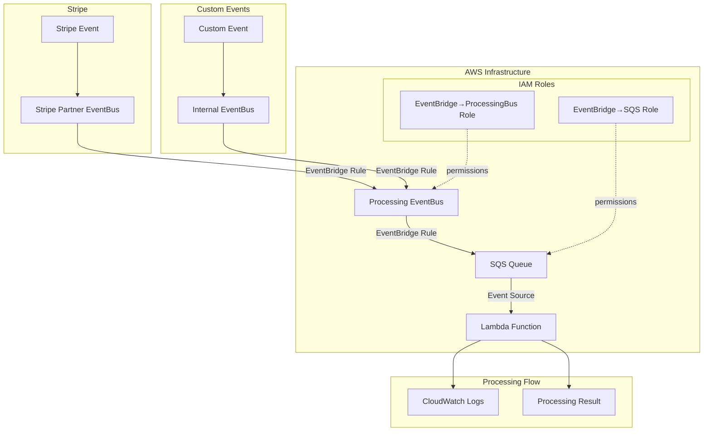

# Stripe CDK Practice

## 概要

このプロジェクトは、AWS CDKを使用してStripeのイベントを処理するためのイベント駆動型アーキテクチャを構築するサンプルです。Stripe Partner EventBusから受信したイベントを、複数のEventBusを経由してSQSキューに送信し、Lambda関数で処理します。

### アーキテクチャ図



### イベントフロー

1. **Stripe イベント**: Stripe Partner EventBusからのイベントを受信
2. **カスタムイベント**: Internal EventBusから独自のイベントを受信
3. **イベント集約**: 両方のイベントをProcessing EventBusに転送
4. **キューイング**: Processing EventBusからSQSキューにイベントを送信
5. **処理**: Lambda関数がSQSキューからイベントを処理

## セットアップ手順

### 1. AWS CDKのセットアップ

```bash
# CDKをグローバルにインストール
npm install -g aws-cdk

# AWS認証情報を設定
aws configure

# CDKのブートストラップ（初回のみ）
cdk bootstrap
```

**参考リンク**:
- [AWS CDK Getting Started](https://docs.aws.amazon.com/cdk/v2/guide/getting_started.html)
- [AWS CDK Workshop](https://cdkworkshop.com/)

### 2. Stripeのセットアップ

1. Stripe Dashboardにログイン
2. Developers → Webhooks → Add endpoint
3. EventBridge統合を有効化
4. Partner EventBusのARNを取得

**参考リンク**:
- [Stripe EventBridge Integration](https://stripe.com/docs/webhooks/eventbridge)
- [Stripe Partner EventBus Setup](https://docs.aws.amazon.com/eventbridge/latest/userguide/eb-saas-furls.html)

### 3. 環境変数の設定

プロジェクトルートに`.env`ファイルを作成：

```env
STRIPE_PARTNER_EVENT_BUS_ARN=arn:aws:events:us-east-1:123456789012:event-bus/aws.partner/stripe.com/acct_xxxxx/stripe-events
```

### 4. 依存関係のインストール

```bash
npm install
```

## デプロイ手順

### 1. TypeScriptをコンパイル

```bash
npm run build
```

### 2. CDKスタックをデプロイ

```bash
# デプロイ前の確認
cdk diff

# デプロイ実行
cdk deploy
```

### 3. デプロイ後の確認

```bash
# デプロイされたリソースを確認
aws cloudformation describe-stacks --stack-name StripeCdkPracticeStack
```

## テストイベントの発行方法

### 1. AWS CLIを使用したカスタムイベントの発行

```bash
# Internal EventBusにカスタムイベントを送信
aws events put-events --entries \
  '[{
    "Source": "custom.stripe.test",
    "DetailType": "Test Event",
    "Detail": "{\"message\": \"Hello from custom event\"}",
    "EventBusName": "InternalEventBus"
  }]'
```

### 2. Stripe Dashboard経由でのテストイベント

1. Stripe Dashboard → Developers → Webhooks
2. 対象のEndpointを選択
3. "Send test webhook"をクリック
4. イベントタイプを選択してテストイベントを送信

### 3. EventBridge Console経由でのテストイベント

1. AWS Console → EventBridge → Event buses
2. "ProcessingEventBus"を選択
3. "Send events"をクリック
4. テストイベントを作成して送信

## ログの確認方法

### 1. CloudWatch Logsでの確認

```bash
# Lambda関数のログを確認
aws logs describe-log-groups --log-group-name-prefix /aws/lambda/StripeCdkPracticeStack

# ログストリームを確認
aws logs describe-log-streams --log-group-name /aws/lambda/StripeCdkPracticeStack-StripeEventProcessorFunction

# ログイベントを確認
aws logs get-log-events --log-group-name /aws/lambda/StripeCdkPracticeStack-StripeEventProcessorFunction --log-stream-name [LOG_STREAM_NAME]
```

### 2. AWS Console経由での確認

1. AWS Console → CloudWatch → Log groups
2. `/aws/lambda/StripeCdkPracticeStack-StripeEventProcessorFunction*`を選択
3. 最新のログストリームを選択してログを確認

### 3. SQSキューの監視

```bash
# SQSキューの状態を確認
aws sqs get-queue-attributes --queue-url [QUEUE_URL] --attribute-names All

# キューにメッセージが残っているか確認
aws sqs receive-message --queue-url [QUEUE_URL]
```

### 4. EventBridgeメトリクスの確認

```bash
# EventBridgeルールのメトリクスを確認
aws cloudwatch get-metric-statistics \
  --namespace AWS/Events \
  --metric-name MatchedEvents \
  --dimensions Name=RuleName,Value=StripePartnerToProcessingBusRule \
  --start-time 2024-01-01T00:00:00Z \
  --end-time 2024-01-01T23:59:59Z \
  --period 300 \
  --statistics Sum
```

## 開発・デバッグ用のコマンド

```bash
# TypeScriptのwatchモード
npm run watch

# CDKのwatchモード（変更を自動デプロイ）
cdk watch

# テストの実行
npm test

# CDKテンプレートの確認
cdk synth
```

## リソースの削除

```bash
# スタックを削除
cdk destroy
```

## トラブルシューティング

### よくある問題と解決方法

1. **環境変数が設定されていない**
   - `.env`ファイルの作成と`STRIPE_PARTNER_EVENT_BUS_ARN`の設定を確認

2. **権限エラー**
   - AWS認証情報とIAMロールの設定を確認
   - CDKのbootstrapが実行されているか確認

3. **EventBridgeルールが動作しない**
   - EventBridge Consoleでルールとターゲットの設定を確認
   - IAMロールの権限を確認

4. **Lambda関数でエラーが発生する**
   - CloudWatch Logsでエラーログを確認
   - SQSキューのDLQ設定を検討
